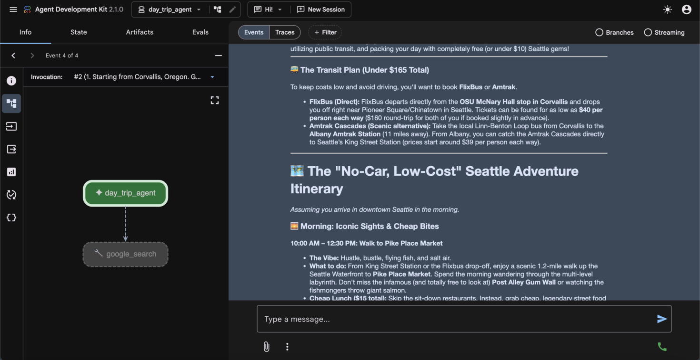

# adk-bot

A set of AI agents built with Google ADK as I learn/explore their SDK

## Who is this for?

Me, mostly, as a way to jog my memory when starting new ADK projects.

## What's in the repo? 

Right now, 3 agents, adapted from [this ADK Crash course](https://codelabs.developers.google.com/onramp/instructions#0) and its attendand [Google Collab Notebook](https://colab.research.google.com/drive/1zzTZ8t6aYFbsyrWpGAtmirNdA9R-bbWz#scrollTo=z2mDXEA8iuRM)

The agents are: 


## Setup guide

If you have just downloaded this repository, you need to pull in `google-adk` and `google-generativeai`. I recommend using `uv` for this:

Get set up with:

```sh
uv init
uv venv
source .venv/bin/activate
uv add google-adk google-generativeai
```

### Create a new agent

*New* can be boostrapped quickly with the `adk` command, like so:

```
adk create day_trip_agent
```

### Run existing agents

Locate the folder containing the agent you're interested in, such as `day_trip_agent` or `multi_day_trip_agent`. Navigate into the directory containing that agent.

**Note:** You do *not* need to navigate into the folder containing `agent.py`. You want to stay one directory above that. 

#### Running from the terminal

If you want to interact with your agent via CLI, run with:

```
adk run name_of_agent
```
#### Running with a web UI

To run with a friendly web UI, simply run:

```
adk web --port 8000
```

The web interface makes it easy to interact with agents and debug them in real time, and responses are nicely formatted via Markdown:



